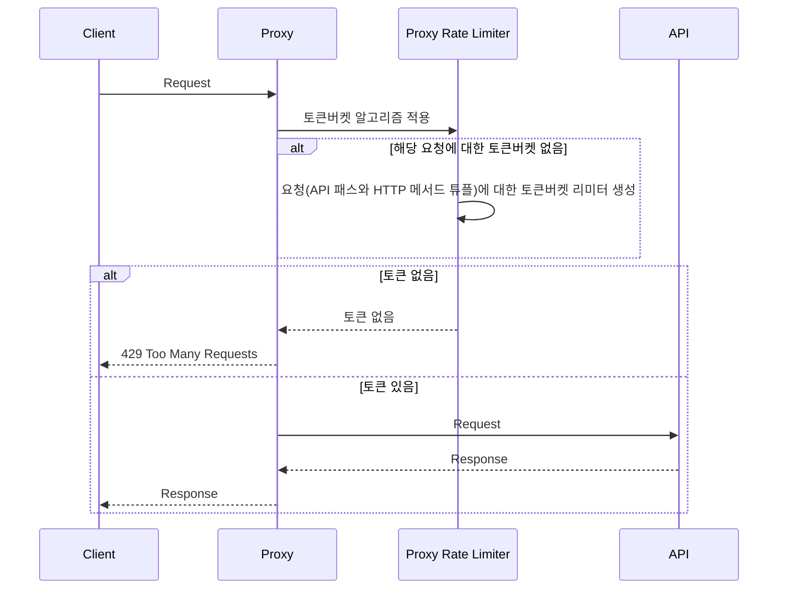

# 처리율 제한 프록시
토큰버킷 알고리즘 기반의 처리율 제한 작업을 수행하는 프록시 서버입니다.

## 실행
```bash
$ poetry shell
$ poetry install
$ uvicorn proxy.main:app --port 8000 --reload
$ uvicorn api.main:app --port 9999 --reload
```

## 테스트
```bash
$ locust -f locustfile.py --host http://localhost:8000 --users 10 --spawn-rate 1 --run-time 1m
```

## 다이어그램


## 참고
FastAPI에 대해서 스로틀링을 지원하는 다양한 패키지가 존재한다.
### 관련패키지
- https://github.com/laurentS/slowapi
- https://pypi.org/project/fastapi-limiter/

### 참고사이트
- https://www.binaryflavor.com/fastapi-throttling-gineung-guhyeon/
- https://github.com/shanesoh/deploy-ml-fastapi-redis-docker/blob/master/docker-compose.yml
- https://velog.io/@cloudjun/Docker%EB%A1%9C-%EC%8B%9C%EC%9E%91%ED%95%98%EB%8A%94-Redis
- https://stackoverflow.com/questions/70610266/proxy-an-external-website-using-python-fast-api-not-supporting-query-params
- https://fastapi.tiangolo.com/tutorial/middleware/
