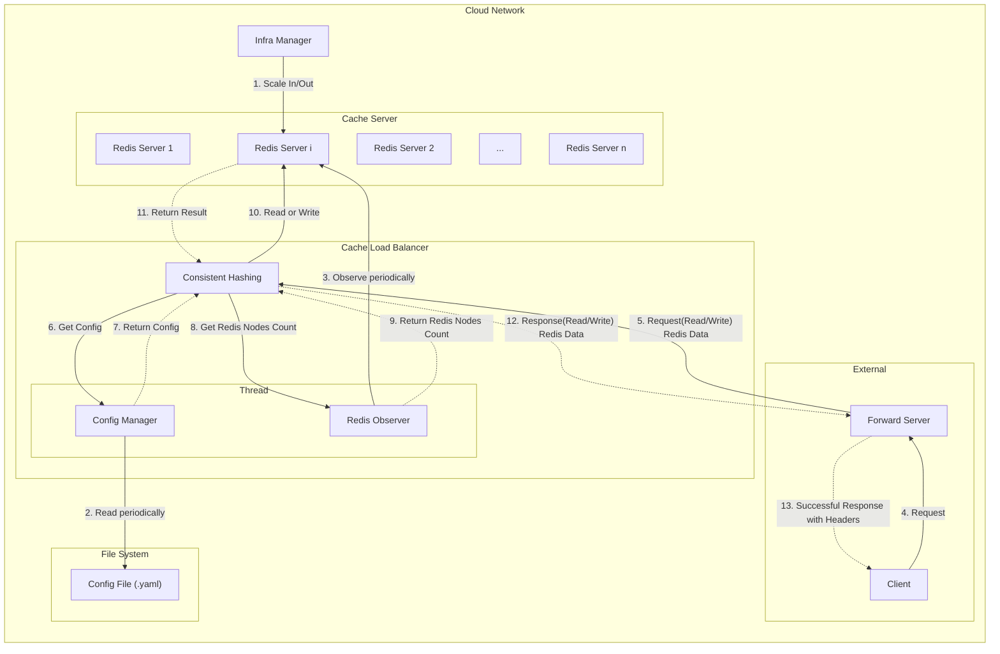
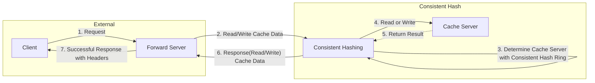

## 실행
```bash
$ pip install poetry
$ poetry shell
$ poetry install
```

```bash
$ uvicorn consistent_hash_server:app --reload --port 9999
$ uvicorn api_server:app --reload --port 8000
```

## 아키텍처

### 실제 서비스 아키텍처


### 프로젝트 아키텍처


## 테스트 실행 방법

## 참고