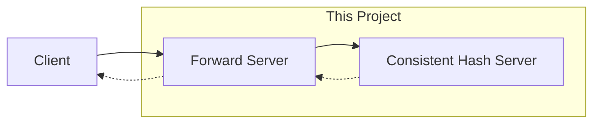
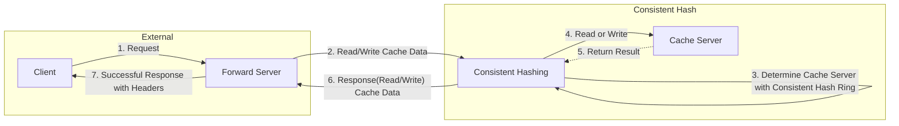
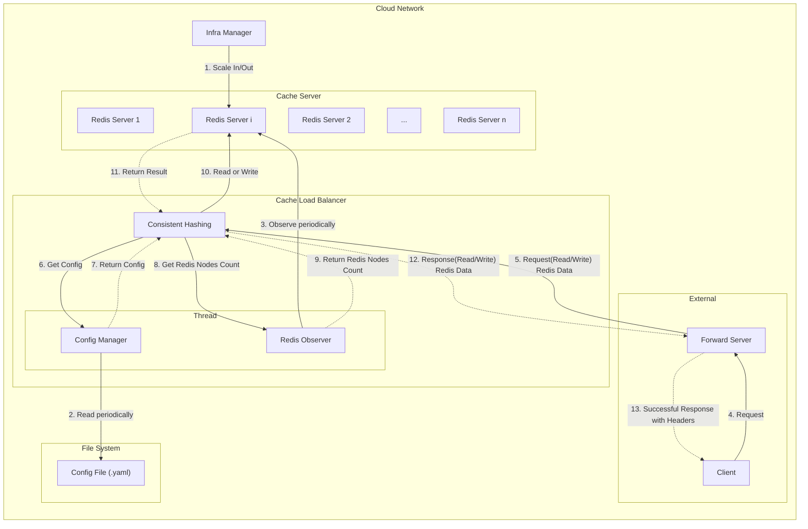

# chapter_05_design_consistent_hashing
## Tech Specs
### Goal
챕터 4의 가상 노드 기법을 사용한 Consistent Hashing을 구현하고 이를 테스트하는 것이 목표입니다.

### Requirements
- [x] 캐시 서버 로드 밸런서를 구현해야합니다.
- [x] 안정 해시 기법은 기본 구현법의 두 가지 문제를 보완한 가상 노드 기법이어야 합니다.
- [x] 캐시 서버 로드밸런서는 서버가 추가되거나 삭제될 경우 저장되어 있는 키들의 재배치가 필요합니다.
- [x] HTTP 통신이 이뤄져야 하고, 서버 응답에는 다음 내용이 헤더에 담겨야 합니다.
    - X-CacheServer-Index: 데이터를 가져온 캐시서버 인덱스
    - X-CacheServer-Count: 현재 가용중인 캐시 서버 개수
    - X-CacheServer-Indexes: 모든 캐시서버 인덱스 목록 (캐시서버 인덱스는 쉼표로 구분)
    - X-Ring-Distribution: 각 캐시서버에 저장된 키의 개수 (캐시서버 인덱스:개수 쌍은 쉼표로 구분)
- [ ] 서버의 가상노드 개수는 무중단으로 수정할 수 있어야 합니다.
   - 가상 노드 개수가 수정되면 로드 밸런서는 수정된 가상 노드 수로 로드 밸런싱해야합니다.
- [x] README.md에는 **최소 다음의 내용**들이 담겨야 합니다.
    - 아키텍처
        - 모듈 혹은 클래스간 의존성을 보여줄 수 있는 다이어그램
        - 워크 플로우에 대한 설명
    - 테스트 실행 방법
    - 참고한 문서

# Usage
## Installation
- python >= 3.11
- 이외의 사항은 리포지토리를 클론하세요.
```bash
$ pip install poetry
$ poetry shell
$ poetry install
```

## How To Run
```bash
$ uvicorn consistent_hash_server:app --reload --port 9999
$ uvicorn forward_server:app --reload --port 8000
```
실행 화면은 다음과 같습니다.
```bash
INFO:     Will watch for changes in these directories: ['/<YOUR_WORK_DIR>/implementing-system-design-interview/chapter_05_design_consistent_hashing']
INFO:     Uvicorn running on http://127.0.0.1:9000 (Press CTRL+C to quit)
INFO:     Started reloader process [9007] using WatchFiles
INFO:     Started server process [9009]
INFO:     Waiting for application startup.
INFO:     Application startup complete.
```

```bash
INFO:     Will watch for changes in these directories: ['/<YOUR_WORK_DIR>/chapter_05_design_consistent_hashing']
INFO:     Uvicorn running on http://127.0.0.1:8000 (Press CTRL+C to quit)
INFO:     Started reloader process [9525] using WatchFiles
INFO:     Started server process [9527]
INFO:     Waiting for application startup.
INFO:     Application startup complete.
```

# System Design
## Concept

앞단 서버와 캐시 서버 중간의 Consistent Hashing 로드밸런서 서버를 구현했습니다.

### Project Architecture


## Limitations
### Real Service Architecture

이 프로젝트에서는 단순히 Consistent Hashing 로드밸런서를 구현했습니다. 따라서 Python Dictionary 자료구조로 구현된 변수가 캐시서버를 상징합니다.
하지만 실제 서비스에서는 위와 같은 구조를 가집니다. 실제 서비스 레벨에서는 캐시 서버는 로드밸런서 바깥에 존재하고, 
인프라 관리시스템이 해당 캐시서버를 스케일 인/아웃하는 것을 로드밸런서에서 관찰할 것입니다. 캐시서버 수의 변화가 생기면 로드밸런서는 캐시 링을 업데이트합니다.

## Code Structure
```bash
$ tree . tree -I __pycache__
.
├── README.md
├── __init__.py
├── cache_manager.py
├── consistent_hash.py
├── consistent_hash_server.py
├── forward_server.py
├── poetry.lock
├── pyproject.toml
└── test.py
```

## Test
### How To Test
캐시 로드밸런서 서버와 포워드 서버를 실행한 후,
```bash
$ python test.py
```

### Test Result
첫 번째 테스트는 실제로 생성된 캐시서버 중에서 올바르게 캐시서버를 선택하는지 확인하는 테스트입니다.
두 번째 테스트는 100개의 데이터를 write하고, 다시 해당 데이터들을 read하는 테스트입니다.
100개의 데이터에 대해서 3개의 캐시서버와 100개의 가상노드로 구성된 캐시링을 사용했을 때,
5~15%의 에러 히트를 보였습니다. 즉, 약 10%의 데이터가 잘못된 캐시서버에서 읽혔다는 것입니다.

이는 캐시 로드밸런서 서버가 처음에 3개의 캐시서버로 구동되는데 스케일업이 되면서 2개의 캐시서버가 추가되고, 
이에 따라 캐시링을 재배치하기 때문에 발생하는 에러입니다. 이때, 캐시서버를 스케일업 없이 수행한다면 에러히트는 발생하지 않습니다.


## 참고
- [[우아한테크세미나] 191121 우아한레디스 by 강대명님](https://www.youtube.com/watch?v=mPB2CZiAkKM)
- [Consistent hashing에 관한 블로그글 1](https://www.joinc.co.kr/w/man/12/hash/consistent)
- [Consistent hashing에 관한 블로그글 2](https://binux.tistory.com/119)
- [위키피디아 - 일관된 해싱](https://ko.wikipedia.org/wiki/%EC%9D%BC%EA%B4%80%EB%90%9C_%ED%95%B4%EC%8B%B1)