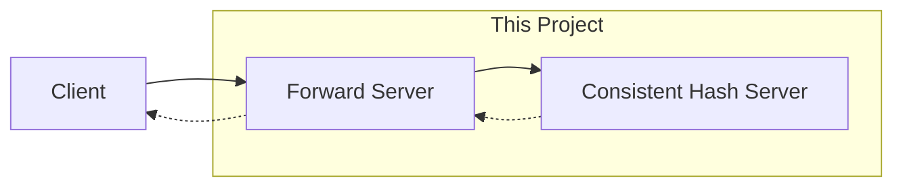
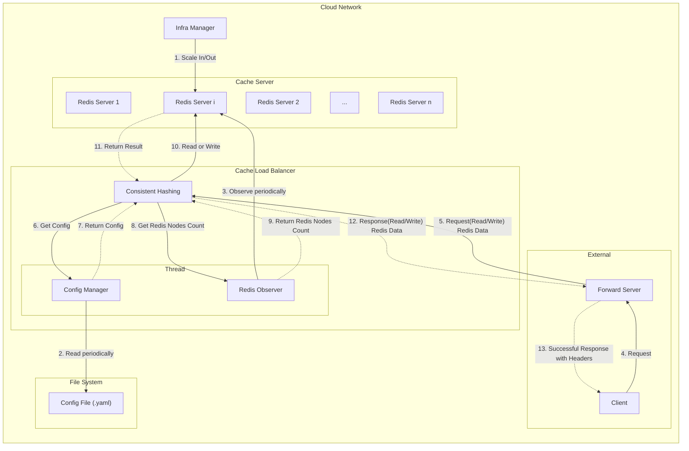
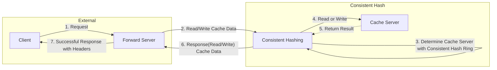

# chapter_05_design_consistent_hashing
## Tech Specs
### Goal
챕터 4의 가상 노드 기법을 사용한 Consistent Hashing을 구현하고 이를 테스트하는 것이 목표입니다.

### Requirements
- [x] 캐시 서버 로드 밸런서를 구현해야합니다.
- [x] 안정 해시 기법은 기본 구현법의 두 가지 문제를 보완한 가상 노드 기법이어야 합니다.
- [x] 캐시 서버 로드밸런서는 서버가 추가되거나 삭제될 경우 저장되어 있는 키들의 재배치가 필요합니다.
- [x] HTTP 통신이 이뤄져야 하고, 서버 응답에는 다음 내용이 헤더에 담겨야 합니다.
    - X-CacheServer-Index: 데이터를 가져온 캐시서버 인덱스
    - X-CacheServer-Count: 현재 가용중인 캐시 서버 개수
- [ ] 서버의 가상노드 개수는 무중단으로 수정할 수 있어야 합니다.
   - 가상 노드 개수가 수정되면 로드 밸런서는 수정된 가상 노드 수로 로드 밸런싱해야합니다.
- [x] README.md에는 **최소 다음의 내용**들이 담겨야 합니다.
    - 아키텍처
        - 모듈 혹은 클래스간 의존성을 보여줄 수 있는 다이어그램
        - 워크 플로우에 대한 설명
    - 테스트 실행 방법
    - 참고한 문서

# Usage
## Installation
- python >= 3.11
- 이외의 사항은 리포지토리를 클론하세요.
```bash
$ pip install poetry
$ poetry shell
$ poetry install
```

## How To Run
```bash
$ uvicorn consistent_hash_server:app --reload --port 9999
$ uvicorn api_server:app --reload --port 8000
```
실행 화면은 다음과 같습니다.
```bash
INFO:     Will watch for changes in these directories: ['/<YOUR_WORK_DIR>/implementing-system-design-interview/chapter_05_design_consistent_hashing']
INFO:     Uvicorn running on http://127.0.0.1:9000 (Press CTRL+C to quit)
INFO:     Started reloader process [9007] using WatchFiles
INFO:     Started server process [9009]
INFO:     Waiting for application startup.
INFO:     Application startup complete.
```

```bash
INFO:     Will watch for changes in these directories: ['/<YOUR_WORK_DIR>/chapter_05_design_consistent_hashing']
INFO:     Uvicorn running on http://127.0.0.1:8000 (Press CTRL+C to quit)
INFO:     Started reloader process [9525] using WatchFiles
INFO:     Started server process [9527]
INFO:     Waiting for application startup.
INFO:     Application startup complete.
```

# System Design
## Concept


### 실제 서비스 아키텍처


### 프로젝트 아키텍처


## 테스트 실행 방법

## 참고