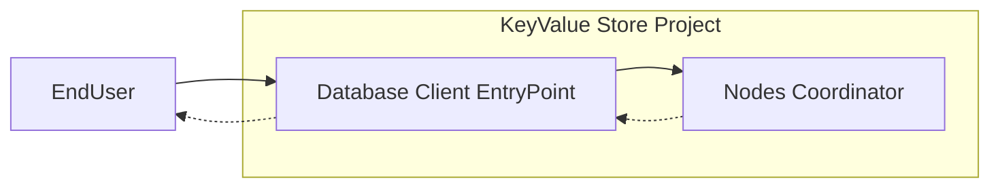
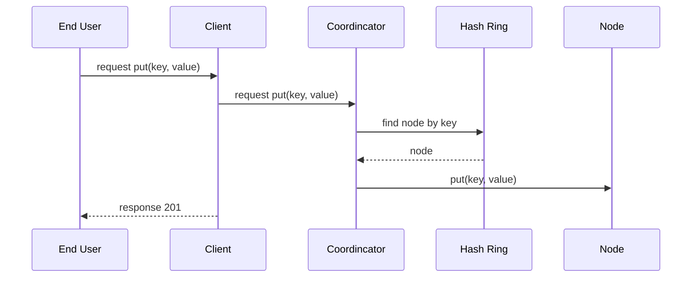
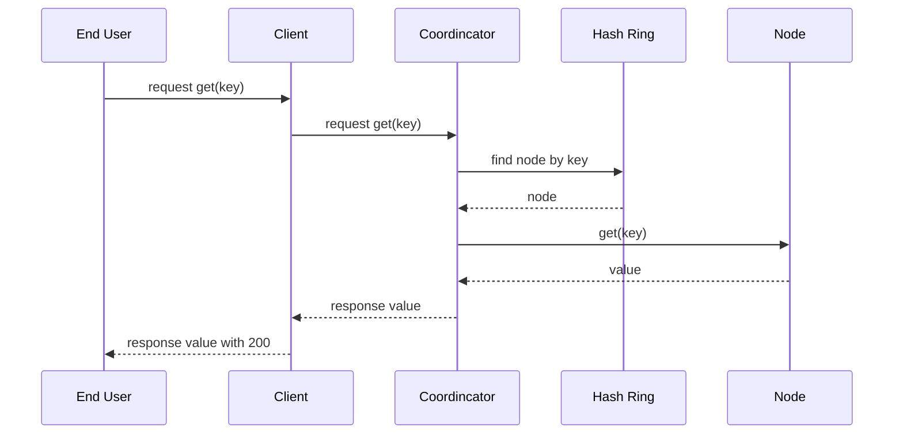

<p align="center">
  <a href="http://nestjs.com/" target="blank"></a>
</p>

[circleci-image]: https://img.shields.io/circleci/build/github/nestjs/nest/master?token=abc123def456
[circleci-url]: https://circleci.com/gh/nestjs/nest

  <p align="center">A progressive <a href="http://nodejs.org" target="_blank">Node.js</a> framework for building efficient and scalable server-side applications.</p>
    <p align="center">
<a href="https://www.npmjs.com/~nestjscore" target="_blank"></a>
<a href="https://www.npmjs.com/~nestjscore" target="_blank"></a>
<a href="https://www.npmjs.com/~nestjscore" target="_blank"></a>
<a href="https://circleci.com/gh/nestjs/nest" target="_blank"></a>
<a href="https://coveralls.io/github/nestjs/nest?branch=master" target="_blank"></a>
<a href="https://discord.gg/G7Qnnhy" target="_blank"></a>
<a href="https://opencollective.com/nest#backer" target="_blank"></a>
<a href="https://opencollective.com/nest#sponsor" target="_blank"></a>
  <a href="https://paypal.me/kamilmysliwiec" target="_blank"></a>
    <a href="https://opencollective.com/nest#sponsor"  target="_blank"></a>
  <a href="https://twitter.com/nestframework" target="_blank"></a>
</p>
  <!--[](https://opencollective.com/nest#backer)
  [](https://opencollective.com/nest#sponsor)-->

# chapter_06_design_a_key_value_store
## Tech Specs
### Goal
챕터 6의 가상 노드 기반의 Key/Value 저장소를 구현하는 것이 목표입니다.

## Requirements
- 안정 해시를 이용하여 데이터를 파티셔닝할 수 있어야 합니다.
- N개의 서버에 데이터를 다중화할 수 있어야 합니다.
- 정족수 합의 프로토콜을 사용하여 데이터의 일관성을 보장하여야 합니다.
- 버저닝과 벡터 시계를 이용하여 비일관성을 해소할 수 있어야 합니다.
- 다음 장애의 종류 중 최소 하나에 대한 처리 가능해야 합니다.
    - 가십 프로토콜을 사용하여 장애를 감지할 수 있어야 합니다.
    - 쓰기/읽기 연산을 금지 또는 임시 위탁 기법을 이용하여 일시적 장애를 처리합니다.
    - 머클 트리를 이용한 반 엔트로피 프로토콜을 구현하여 영구적 장애를 처리합니다.
- 커밋 로그, SSTable을 지원하는 쓰기 기능을 제공해야 합니다.
- 블룸 필터를 활용한 읽기 기능을 제공해야 합니다.
- 아래 기법 또는 프로토콜 중 최소 1개는 구현해야 합니다.
    - 정족수 합의 프로토콜(ex. 정족수)
    - 가십 프로토콜(ex. 미갱신 허용 시간)
    - 반 엔트로피 프로토콜(ex. 버킷 개수)
    - 버저닝과 벡터 시계(ex. [서버:버전] 순서쌍의 개수 임계치)
    - 임시 위탁 기법
- 아래 기법 또는 프로토콜과 관련된 설정은 무중단으로 수정할 수 있어야 합니다.
    - 정족수 합의 프로토콜(ex. 정족수)
    - 가십 프로토콜(ex. 미갱신 허용 시간)
    - 반 엔트로피 프로토콜(ex. 버킷 개수)
    - 버저닝과 벡터 시계(ex. [서버:버전] 순서쌍의 개수 임계치)
- 구현된 알고리즘은 누구나 테스트 가능해야 하고, 테스트를 시행한 문서가 남아야 합니다.

## Installation

```bash
$ npm install
```

## Running the app

```bash
# development
$ npm run start

# watch mode
$ npm run start:dev

# production mode
$ npm run start:prod
```

## System Design
### Concept

앞단 엔트리포인트인 클라이언트와 노드 중재자(coordinator)를 구현했습니다.

### Put(Key, Value) Sequence


### Get(Key) Sequence


## Code Structure
```bash
tree . tree -I node_modules -I dist 
.
├── README.md
├── nest-cli.json
├── package-lock.json
├── package.json
├── src
│   ├── app.controller.ts
│   ├── app.module.ts
│   ├── app.service.ts
│   ├── client
│   │   ├── client.controller.ts
│   │   ├── client.module.ts
│   │   └── client.service.ts
│   ├── coordinator
│   │   ├── consistentHash.ts
│   │   ├── coordinator.controller.ts
│   │   ├── coordinator.module.ts
│   │   ├── coordinator.service.ts
│   │   └── put-value.dto.ts
│   └── main.ts
├── test
│   ├── app.e2e-spec.ts
│   └── jest-e2e.json
├── tsconfig.build.json
└── tsconfig.json
tree
[1]    16705 segmentation fault  tree . tree -I node_modules -I dist
```

## Test

```bash
# unit tests
$ npm run test

# e2e tests
$ npm run test:e2e
```

## License

Nest is [MIT licensed](LICENSE).
